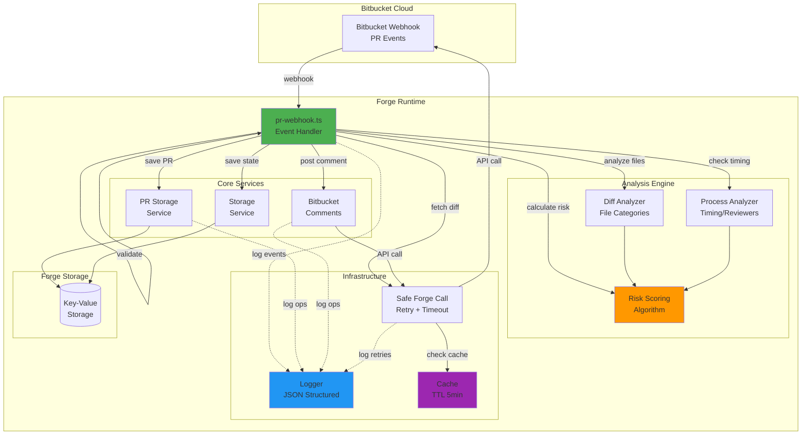
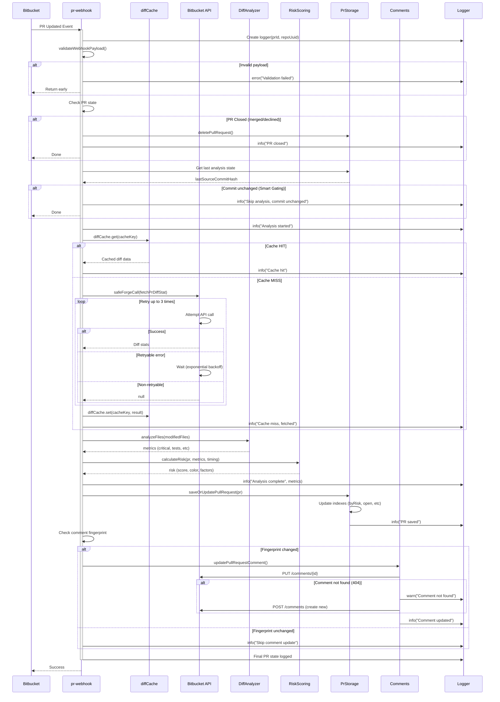
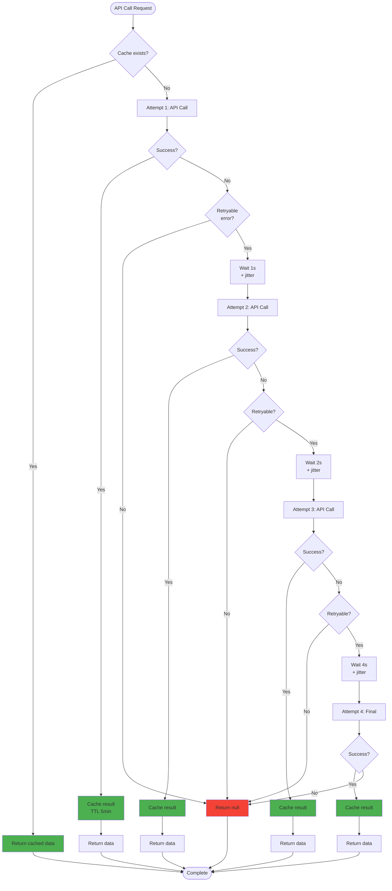
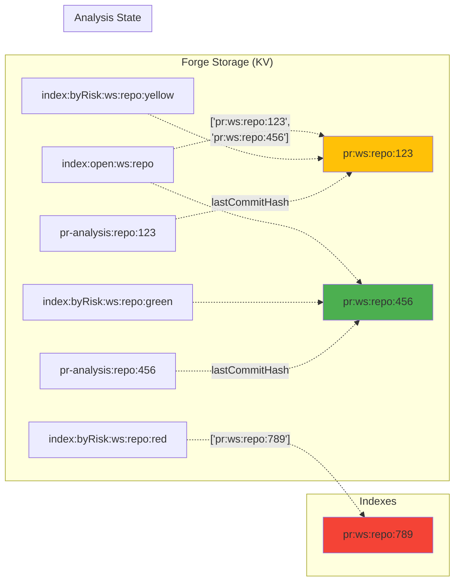
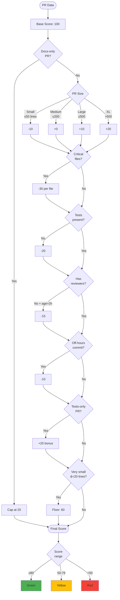

# Architecture - PitCrew AI

Documentation technique de l'architecture avec diagrammes Mermaid.

---

## 🏗️ Architecture Globale

---

## 🔄 Séquence Webhook PR

---

## 🔄 Retry Logic avec Cache

---

## 📊 Storage Architecture

---

## 🎯 Risk Scoring Flow

---

## 📝 Composants Clés

### Webhook Handler
- **Fichier:** `pr-webhook.ts`
- **Rôle:** Point d'entrée, orchestration
- **Responsabilités:**
  - Validation payload
  - Smart gating (skip si commit inchangé)
  - Orchestration analyse
  - Gestion commentaires

### Services
- **PR Storage:** CRUD PRs + indexes (risk, open, repo)
- **Bitbucket Comments:** Create/update comments API
- **Storage:** Analysis state (commits hash tracking)

### Analyseurs
- **Diff Analyzer:** Catégorise fichiers (critical, tests, docs, etc.)
- **Process Analyzer:** Timing (off-hours), reviewers
- **Risk Scoring:** Algorithme de score avec pénalités/bonus

### Infrastructure
- **Logger:** JSON structuré avec contexte
- **Cache:** TTL 5min pour diffs
- **Retry:** Exponential backoff + jitter

---

## 🔐 Sécurité

Voir [SECURITY.md](file:///d:/Documents/Development/Projects/Hackathons%20Projects/Pitcrew-AI-Atlassian/apps/forge-bitbucket/SECURITY.md) pour détails complets.

**Scopes:**
- `storage:app` - Persistence
- `read:pullrequest:bitbucket` - Diff stats
- `write:comment:bitbucket` - Post comments

**Données:** Aucune PII, seulement metadata PR
